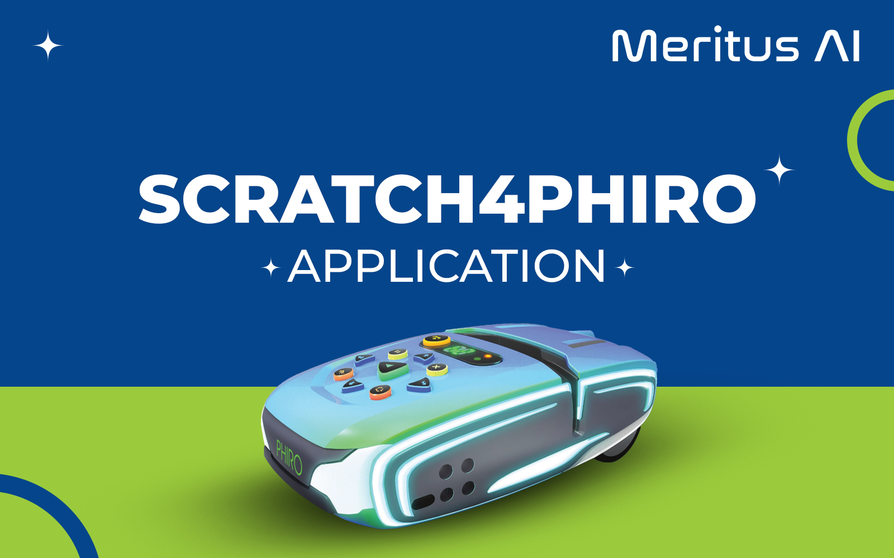

## SCRATCH FOR PHIRO

    

Welcome to the world of Scratch4Phiro, where you can bring your ideas to life and make the Phiro robot do amazing things! 

This guide will help you install and setup Scratch4Phiro on a Windows computer. Follow these steps, and you'll be ready to create your very first program in no time. Let's dive into the fun of coding and robotics !

## You can download the Scratch4Phiro Application from this [link](https://drive.google.com/drive/u/2/folders/1rOG1lQMP_9CPBQqnD8n4YXOZBx_oV1Oc)

## Download a Scratch4phiro Sample Program from this [link](https://drive.google.com/drive/folders/1UHYeajDcK3jpNzzfC3a9UBK4FeHGl4Rw)

## Contact

- Contact us via [Email](mailto:support@meritus.ai)

