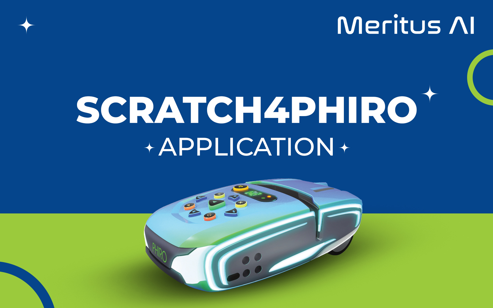

# SCRATCH FOR PHIRO

    

Welcome to the world of Scratch4Phiro, where you can bring your ideas to life and make the Phiro robot do amazing things! 

## Scratch4Phiro Application For Windows :

This guide will help you install and setup Scratch4Phiro on a Windows computer. Follow these steps, and you'll be ready to create your very first program in no time. Let's dive into the fun of coding and robotics !

1. You can download the Scratch4Phiro Windows Application from this [link](https://drive.google.com/drive/u/2/folders/1rOG1lQMP_9CPBQqnD8n4YXOZBx_oV1Oc)

2. You can download the Scratch4phiro Sample Program from this [link](https://drive.google.com/drive/folders/1UHYeajDcK3jpNzzfC3a9UBK4FeHGl4Rw)

3. You can download the Scratch4phiro Installation Guide for Windows from this [link](https://github.com/robotixdevteam/SCRATCH_4_PHIRO/tree/main/Installation%20Guide/Windows%20Guide)

4. You can view the Scratch4phiro Installation Video Guide for Windows from this [link](https://vimeo.com/1169067650/ff58160553)

## Scratch4Phiro Application For MacOS:

This guide will help you install and setup Scratch4Phiro on a Mac computer. Follow these steps, and you'll be ready to create your very first program in no time. Let's dive into the fun of coding and robotics !

1. You can download the Scratch4Phiro Mac Application from this [link](https://drive.google.com/file/d/1E8M-4aQ5jnVOlBJLrvLsYX16FQBKuH7Z)

2. You can download the Scratch4phiro Sample Program from this [link](https://drive.google.com/file/d/1E8M-4aQ5jnVOlBJLrvLsYX16FQBKuH7Z)

3. You can download the Scratch4phiro Installation Guide for MacOS from this [link](https://github.com/robotixdevteam/SCRATCH_4_PHIRO/tree/main/Installation%20Guide/Mac%20Guide)

4. You can view the Scratch4phiro Installation Video Guide for MacOS from this [link](https://vimeo.com/1169067628/c06c573184)

## Contact

- Contact us via [Email](mailto:support@meritus.ai)

